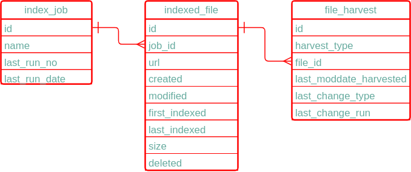

## Manifest processing

### Background

To support the required integration with the pipeline a number of custom components were added during the first
pipeline project and harvesters is use at the time updated to use them.

The pipeline calls the configured harvester for a collection to harvest/delete harvested metadata/data,
passing the location of the temporary directory into which incoming files have been placed (base) and 
the location of a manifest file containing the list of files to be processed (fileList) as context parameters.
Where a file in the manifest does not exist in the temporary directory, this should trigger deletion of 
any harvested metadata/data for that file.

### Supporting tables

Manifest processing components use the following tables in the harvesters schema to record state between 
harvests.  They were used prior to the introduction of manifest processing when pipeline style processing
was performed in talend harvesters and were re-purposed to minimise the changes required to harvesters at 
the time.

#### index_job

This table contains details of each harvesting job identifier used.  Prior to manifest processing, a numbner of indexing
jobs could be run by a particular harvester e.g. for files from different sources.   For manifest 
processing only one job is normally used and this table now just records the last run number.

column | description
--- | --- 
id | unique identifier for each record 
name | name of the indexing job
last_run_no | run number allocated to last run for this job
last_run_date | date of last run

### indexed_file

This table contains a list of every file harvested by the harvester for a particular job

column | description
--- | ---
id | unique identifier for a file
job_id | job which included the file
url | relative url of the file on s3
created | creation date of file
modified | last modified date of file 
first_indexed | date the file was first harvested
last_indexed | date the file was last harvested
size | size of the file in bytes
deleted | records whether the file has been deleted

### file_harvest

This table records what harvesting action is/was required for a file in the last harvester run (could be the current run)

Note that its possible to perform different types of harvesting on a file and so the table records 
harvest action is/was required for a particular file for a particular type of harvest.

This table was used in the past to allow processing to be restarted in the event of an error, but is not 
required for that purpose any more as the pipeline controls what files need to be processed.

id | unique identifier for harvest action
harvest_type | type of harvest recorded
file_id | id of file being harvested
last_moddate_harvested | last modification date harvested (not used for manifest processing)
last_change_type | 'modified', 'new' or 'deleted'
last_change_run | run number harvesting action applied/applies to

### Manifest processing components

* iUpdateIndex - update index_job and indexed_file to record a new harvester job run and
  the files to be processed or deleted in that run for the supplied manifest file and directory contents 
* iNewFileList - iterate over all newly added files in the current harvester run for the specified harvest type and job
   and update file_harvest as each file is processed to record action performed.
* iModifiedFileList - iterate over all 'updated' files in the current harvester run for the specified harvest type and job
   and update file_harvest  as each file is processed to record action performed.
* iNewOrModifiedFileList - iterate over all new or updated files in the current harvester run for the specified harvest type and job
  and update file_harvest  as each file is processed to record action performed.
* iDeletedFileList - iterate over all deleted files in the current harvester run for the specificied harvest type and job
  and update file_harvest  as each file is processed to record action performed.

