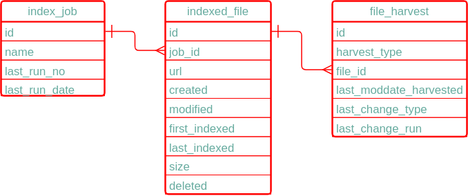

## Pipeline Integration

This page describes the components added during the first pipeline project to package common logic required to process 
manifest files/staged files and trigger required harvesting actions for use in harvesters.

### Context

When a pipeline is configured to harvest metadata/data from incoming files for a collection, the harvester is called
passing the location of the temporary directory into which incoming files have been placed (base) and 
the location of a manifest file containing the list of files to be processed (fileList) along with any 
environment/collection specific configured for that collection in chef-private. Where a file in the manifest does 
not exist in the temporary directory, this triggers deletion of any previously harvested metadata/data for that file.

### Supporting tables

Pipeline integration components use the following tables in the harvesters schema to record state during/between 
harvests.

#### index_job

This table records harvesting jobs run in the schema.  For manifest processing only one job is normally used and this table 
just records the last run details for that job.

column | description
--- | --- 
id | unique identifier for each record 
name | name of the indexing job
last_run_no | run number allocated to last run for this job
last_run_date | date of last run

### indexed_file

This table contains a list of every file harvested by the harvester for a particular job

column | description
--- | ---
id | unique identifier for a file
job_id | job which included the file
url | relative url of the file on s3
created | creation date of file
modified | last modified date of file 
first_indexed | date the file was first harvested
last_indexed | date the file was last harvested
size | size of the file in bytes
deleted | records whether the file has been deleted

### file_harvest

This table records what harvesting action is/was required for a file in the last harvester run (could be the current run)

Note that its possible to perform different types of harvesting on a file (e.g. metadata and data) and so the table records what 
harvest action is/was required for a particular file for a particular type of harvest.

This table was used in the past prior to the pipeline project to allow processing to be restarted in the event of an error,
but is not required for that purpose any more as the pipeline controls what files need to be processed.

id | unique identifier for harvest action
harvest_type | type of harvest recorded
file_id | id of file being harvested
last_moddate_harvested | last modification date harvested (not used for manifest processing)
last_change_type | 'modified', 'new' or 'deleted'
last_change_run | run number harvesting action applied/applies to

### Manifest processing components

* iUpdateIndex - update index_job and indexed_file to record a new harvester job run and
  the files to be processed or deleted in that run for the supplied manifest file and directory contents 
* iNewFileList - iterate over all newly added files in the current harvester run for the specified harvest type and job
   and update file_harvest as each file is processed to record action performed.
* iModifiedFileList - iterate over all 'updated' files in the current harvester run for the specified harvest type and job
   and update file_harvest  as each file is processed to record action performed.
* iNewOrModifiedFileList - iterate over all new or updated files in the current harvester run for the specified harvest type and job
  and update file_harvest  as each file is processed to record action performed.
* iDeletedFileList - iterate over all deleted files in the current harvester run for the specificied harvest type and job
  and update file_harvest  as each file is processed to record action performed.

