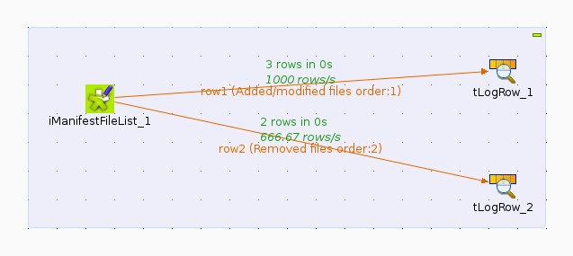

## Outline
Here we document the `iManifestFileList` component, as well as presenting a simple example project which makes use of it.

## Prerequisites
It is assumed that:

* talend is running inside the [PO box](https://github.com/aodn/chef/blob/master/doc/README.examples.md#po-box), with the workspace set to the [example](example) directory;
* the iManifestFileList component is installed and available in the talend palette.

## iManifestFileList Details

The component has two inputs (as can be seen in the screenshot below):

* a manifest file, containing a list of files to process;
* an (optional) base path, depending on whether the above contains *absolute* or *relative* file paths.  If the latter, then this value will be prepended to each file path from the manifest before being passed downstream

The component has two output *flows*:

* `Added/modified files`
* `Removed files`

If a file which is given in the manifest *exists*, then the component will pass it on to the `Added/modified` flow, otherwise, it will be passed on to the `Removed` flow.

Here, we can see what this looks like when these outputs are connected to other components:

## Example Jobs
There are two example jobs, `AbsolutePaths` and `RelativePaths`, both of which are quite straightforward.

In each job, the `iManifestFileList` is connected to two `tLogRow` components.  The first, `tLogRow_1` receives a *flow* of file paths for files from the manifest which have either been added or modified.  The other, `tLogRow_2` receives those which have been removed.

The two jobs differ only in the fact that `AbsolutePaths` job has an input manifest with absolute paths, and you guessed it, `RelativePaths` has relative (to the `base path` parameter) paths.

Here's some example output after running `AbsolutePaths`:

As can be seen, `tLogRow_1` is logging only added/modified files, whereas `tLogRow_2` is logging removed files.

Hopefully, one can see from this example how we could easily swap out the `tLogRow` components for something more useful, for example, an indexing component.

